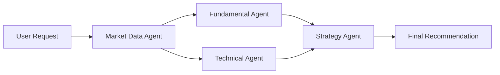

# Developer Guide

Welcome to the AI Financial Analyst development guide. This document will help you understand the codebase and contribute effectively.

## Project Structure

```
financial-analyst/
├── backend/
│   ├── agents/              # Multi-agent system
│   │   ├── base_agent.py    # Base class for all agents
│   │   ├── market_data_agent.py
│   │   ├── fundamental_agent.py
│   │   ├── technical_agent.py
│   │   └── strategy_agent.py
│   ├── orchestrator/        # Agent coordination
│   │   └── graph.py         # LangGraph pipeline
│   ├── config.py            # Configuration management
│   ├── main.py              # FastAPI application
│   ├── utils.py             # Utility functions
│   └── requirements.txt     # Python dependencies
├── frontend/
│   ├── app/
│   │   ├── components/      # Reusable components
│   │   ├── analysis/        # Analysis pages
│   │   ├── globals.css      # Global styles
│   │   ├── layout.tsx       # Root layout
│   │   └── page.tsx         # Home page
│   ├── public/              # Static assets
│   └── package.json         # Node dependencies
├── README.md                # Project overview
├── API.md                   # API documentation
└── DEPLOYMENT.md            # Deployment guide
```

## Architecture

### Multi-Agent System

The backend uses a multi-agent architecture where specialized agents work together:

1. **Market Data Agent**: Fetches real-time and historical market data
2. **Fundamental Agent**: Analyzes financial statements and ratios
3. **Technical Agent**: Analyzes price patterns and indicators
4. **Strategy Agent**: Synthesizes all data and generates recommendations

### Agent Pipeline



### Base Agent Pattern

All agents inherit from `BaseAgent` which provides:
- LLM integration via Google Gemini
- Standard output formatting
- Error handling
- Logging

Example:
```python
class MyAgent(BaseAgent):
    def __init__(self):
        super().__init__(
            name="My Agent",
            description="specialist in doing something"
        )
    
    async def analyze(self, ticker: str) -> Dict[str, Any]:
        # Fetch data
        data = self.fetch_data(ticker)
        
        # Generate LLM insight
        insight = await self.generate_insight(
            prompt="Analyze this data...",
            data=data
        )
        
        # Return formatted output
        return self.format_output(data, insight, confidence=0.8)
```

## Development Setup

### Backend

1. Create virtual environment:
```bash
cd backend
python3 -m venv venv
source venv/bin/activate  # On Windows: venv\Scripts\activate
```

2. Install dependencies:
```bash
pip install -r requirements.txt
```

3. Setup environment:
```bash
cp .env.example .env
# Edit .env and add your GOOGLE_API_KEY
```

4. Run development server:
```bash
uvicorn main:app --reload
```

### Frontend

1. Install dependencies:
```bash
cd frontend
npm install
```

2. Run development server:
```bash
npm run dev
```

## Code Style

### Python

We follow PEP 8 with some modifications:
- Line length: 100 characters
- Use type hints for all function signatures
- Docstrings for all public functions and classes

Example:
```python
async def analyze_stock(
    ticker: str,
    period: str = "1y"
) -> Dict[str, Any]:
    """
    Analyze a stock for the given period.
    
    Args:
        ticker: Stock ticker symbol
        period: Analysis period (default: 1y)
        
    Returns:
        Dictionary containing analysis results
        
    Raises:
        ValueError: If ticker is invalid
    """
    pass
```

### TypeScript/React

- Use functional components with hooks
- Prefer `const` over `let`
- Use TypeScript interfaces for props
- Use CSS modules or global styles (no inline styles except for dynamic values)

Example:
```typescript
interface StockCardProps {
    ticker: string;
    price: number;
    onChange: (ticker: string) => void;
}

export function StockCard({ ticker, price, onChange }: StockCardProps) {
    const [loading, setLoading] = useState(false);
    
    return (
        <div className="card">
            {/* Component content */}
        </div>
    );
}
```

## Adding New Features

### Adding a New Agent

1. Create new file in `backend/agents/`:
```python
from agents.base_agent import BaseAgent

class NewsAgent(BaseAgent):
    def __init__(self):
        super().__init__(
            name="News Agent",
            description="specialist in analyzing financial news"
        )
    
    async def analyze(self, ticker: str) -> Dict[str, Any]:
        # Implementation
        pass
```

2. Add to orchestrator in `backend/orchestrator/graph.py`:
```python
news_agent = NewsAgent()
news_analysis = await news_agent.analyze(ticker)
```

3. Update response model in `main.py`:
```python
class AnalysisResponse(BaseModel):
    # ... existing fields
    news_analysis: dict
```

### Adding a New Endpoint

1. Add to `backend/main.py`:
```python
@app.get("/endpoint/{param}")
async def my_endpoint(param: str) -> MyResponse:
    """
    Endpoint description.
    
    Args:
        param: Parameter description
    """
    from utils import validate_input, get_logger
    
    logger = get_logger(__name__)
    
    # Validate input
    if not validate_input(param):
        raise HTTPException(status_code=400, detail="Invalid input")
    
    try:
        # Process request
        result = process(param)
        return MyResponse(**result)
    except Exception as e:
        logger.error(f"Error: {str(e)}")
        raise HTTPException(status_code=500, detail="Processing failed")
```

2. Update API documentation in `API.md`

### Adding a New Frontend Component

1. Create component file:
```typescript
// frontend/app/components/MyComponent.tsx
'use client';

import { useState } from 'react';

interface MyComponentProps {
    data: any;
}

export function MyComponent({ data }: MyComponentProps) {
    return (
        <div className="card">
            {/* Component content */}
        </div>
    );
}
```

2. Use in pages:
```typescript
import { MyComponent } from '@/app/components/MyComponent';

export default function Page() {
    return <MyComponent data={data} />;
}
```

## Testing

### Backend Tests

Create tests in `backend/tests/`:

```python
import pytest
from agents.market_data_agent import MarketDataAgent

@pytest.mark.asyncio
async def test_get_quote():
    agent = MarketDataAgent()
    quote = await agent.get_quick_quote("RELIANCE")
    
    assert quote["ticker"] == "RELIANCE"
    assert quote["price"] > 0
    assert "name" in quote
```

Run tests:
```bash
pytest backend/tests/
```

### Frontend Tests

Create tests using Jest and React Testing Library:

```typescript
import { render, screen } from '@testing-library/react';
import { StockCard } from './StockCard';

test('renders stock card', () => {
    render(<StockCard ticker="RELIANCE" price={2500} />);
    expect(screen.getByText('RELIANCE')).toBeInTheDocument();
});
```

## Debugging

### Backend

1. Enable debug mode in `.env`:
```env
DEBUG=true
```

2. Add breakpoints or print statements:
```python
import pdb; pdb.set_trace()  # Breakpoint
print(f"Debug: {variable}")
```

3. Check logs:
```bash
# View application logs
tail -f /var/log/financial-analyst.out.log
```

### Frontend

1. Use browser DevTools
2. Add console logs:
```typescript
console.log('Debug:', data);
```

3. Use React DevTools extension

## Common Issues

### "No module named 'agents'"
- Make sure you're in the backend directory
- Activate virtual environment
- Reinstall dependencies

### "Failed to fetch quote"
- Check internet connection
- Verify ticker symbol is valid
- Check yfinance is working: `python -c "import yfinance; print(yfinance.Ticker('RELIANCE.NS').info)"`

### Frontend build errors
- Clear cache: `rm -rf .next node_modules && npm install`
- Check Node version: `node --version` (should be 18+)

## Performance Optimization

### Backend

1. **Caching**: Already implemented with TTL cache
2. **Async operations**: Use `asyncio.gather()` for parallel requests
3. **Connection pooling**: Consider adding for database connections

### Frontend

1. **Code splitting**: Next.js does this automatically
2. **Image optimization**: Use Next.js Image component
3. **Lazy loading**: Use dynamic imports for heavy components

## Contributing

1. Fork the repository
2. Create a feature branch: `git checkout -b feature/my-feature`
3. Make changes and test thoroughly
4. Commit with clear messages: `git commit -m "add feature X"`
5. Push and create pull request

### Commit Message Format

```
<type>: <description>

[optional body]
```

Types:
- `feat`: New feature
- `fix`: Bug fix
- `docs`: Documentation
- `style`: Code style changes
- `refactor`: Code refactoring
- `test`: Adding tests
- `chore`: Maintenance tasks

## Resources

- [FastAPI Documentation](https://fastapi.tiangolo.com/)
- [Next.js Documentation](https://nextjs.org/docs)
- [Google Gemini API](https://ai.google.dev/docs)
- [yfinance Documentation](https://pypi.org/project/yfinance/)
- [pandas-ta Documentation](https://github.com/twopirllc/pandas-ta)

## Getting Help

- Check existing issues on GitHub
- Review API documentation
- Read error messages carefully
- Use print/console.log for debugging
- Ask in discussions or create an issue

## License

This project is licensed under the MIT License.
