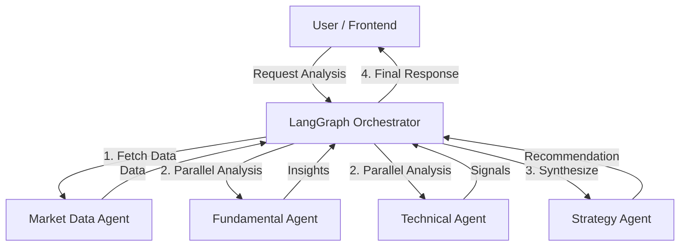

# AI Financial Analyst 📈🤖


A state-of-the-art **Multi-Agent System** designed to analyze **Indian Stock Market (NSE)** data. Powered by **Google Gemini 2.0 Flash**, this AI analyst performs comprehensive fundamental and technical analysis to provide actionable investment recommendations.

## 🚀 Features

*   **Multi-Agent Architecture**: Orchestrated agents specializing in different domains working together.
    *   **Market Data Agent**: Fetches real-time prices, historical data, and company info.
    *   **Fundamental Agent**: Analyzes balance sheets, P&L, cash flow, and financial ratios.
    *   **Technical Agent**: Computes indicators (RSI, MACD, Bollinger Bands), identifies trends, and support/resistance levels.
    *   **Strategy Agent**: Synthesizes all data to generate Buy/Sell/Hold signals with confidence scores and target prices.
*   **LLM-Powered Insights**: Uses **Gemini 2.0** to generate human-readable explanations for complex financial metrics.
*   **Real-time Indian Market Data**: Integrated with `yfinance` and `nsepython` for NSE stocks.
*   **Modern Dashboard**: Premium Next.js frontend with interactive charts (`recharts`), dark mode, and glassmorphism design.

## 🛠️ Tech Stack

### Backend
*   **Framework**: FastAPI
*   **Orchestration**: LangGraph
*   **LLM**: Google Gemini 2.0 Flash (`google-generativeai`)
*   **Data Analysis**: Pandas, Pandas-TA, NumPy
*   **Market Data**: yfinance, nsepython

### Frontend
*   **Framework**: Next.js 14 (App Router)
*   **Language**: TypeScript
*   **Styling**: CSS Modules (Custom Design System)
*   **Visualization**: Recharts, Lucide React

## ⚡ Quick Start

### Prerequisites
*   Python 3.10+
*   Node.js 18+
*   A Google Gemini API Key

### 1. Backend Setup

```bash
# Navigate to backend directory
cd backend

# Create virtual environment
python3 -m venv venv
source venv/bin/activate  # On Windows: venv\Scripts\activate

# Install dependencies
pip install -r requirements.txt

# Configure Environment Variables
# Create a .env file and add your Google API Key
echo "GOOGLE_API_KEY=your_actual_api_key_here" > .env

# Run the server
uvicorn main:app --reload
```

The API will be available at `http://localhost:8000`.

### 2. Frontend Setup

```bash
# Navigate to frontend directory
cd frontend

# Install dependencies
npm install

# Run the development server
npm run dev
```

Open `http://localhost:3000` in your browser to start analyzing stocks!

## 🖥️ Screen Usage

1.  Enter an NSE stock symbol (e.g., `RELIANCE.NS`, `TCS.NS`, `INFY.NS`) in the search bar.
2.  View the **Overview** tab for the final AI recommendation and price history.
3.  Explore **Fundamental** and **Technical** tabs for deep-dive metrics and charts.

## 🏗️ Architecture



## 🤝 Contributing

Contributions are welcome! Please feel free to submit a Pull Request.

## 📄 License

This project is licensed under the MIT License.
